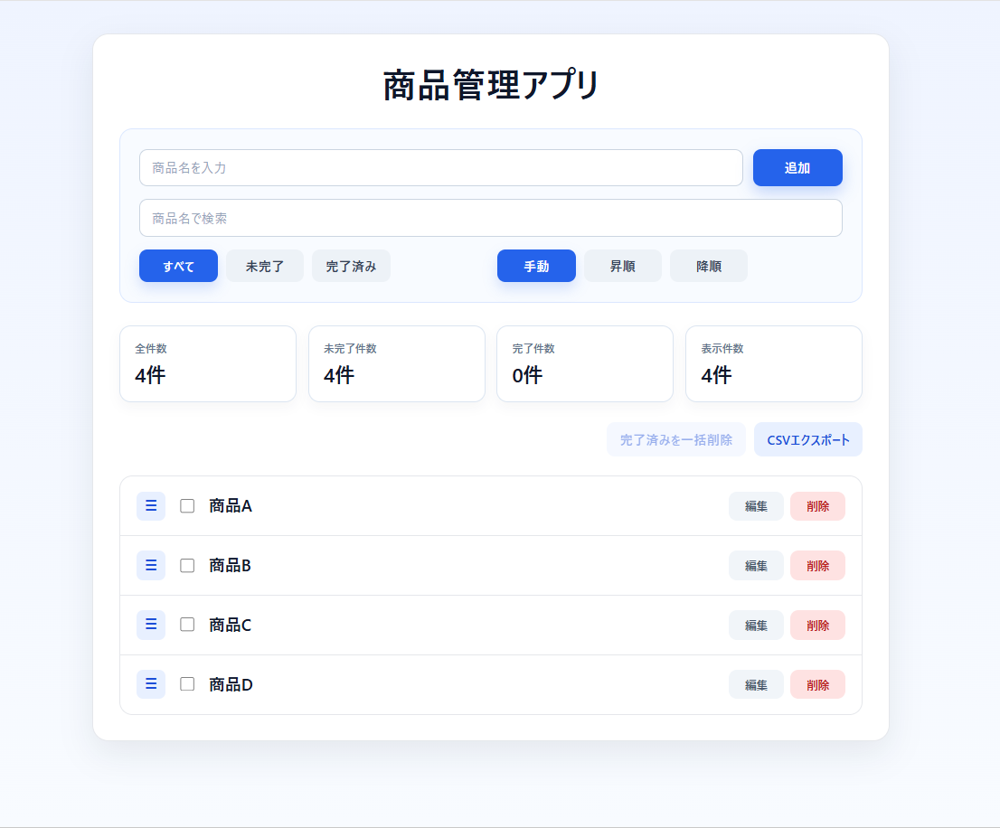
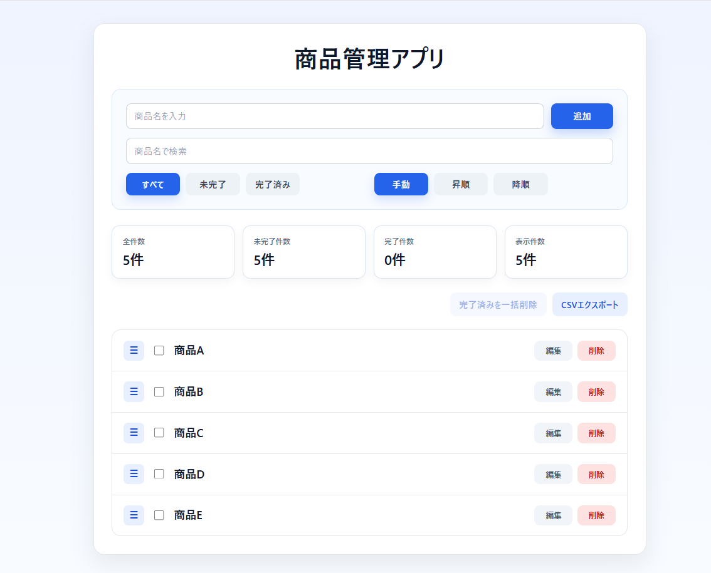
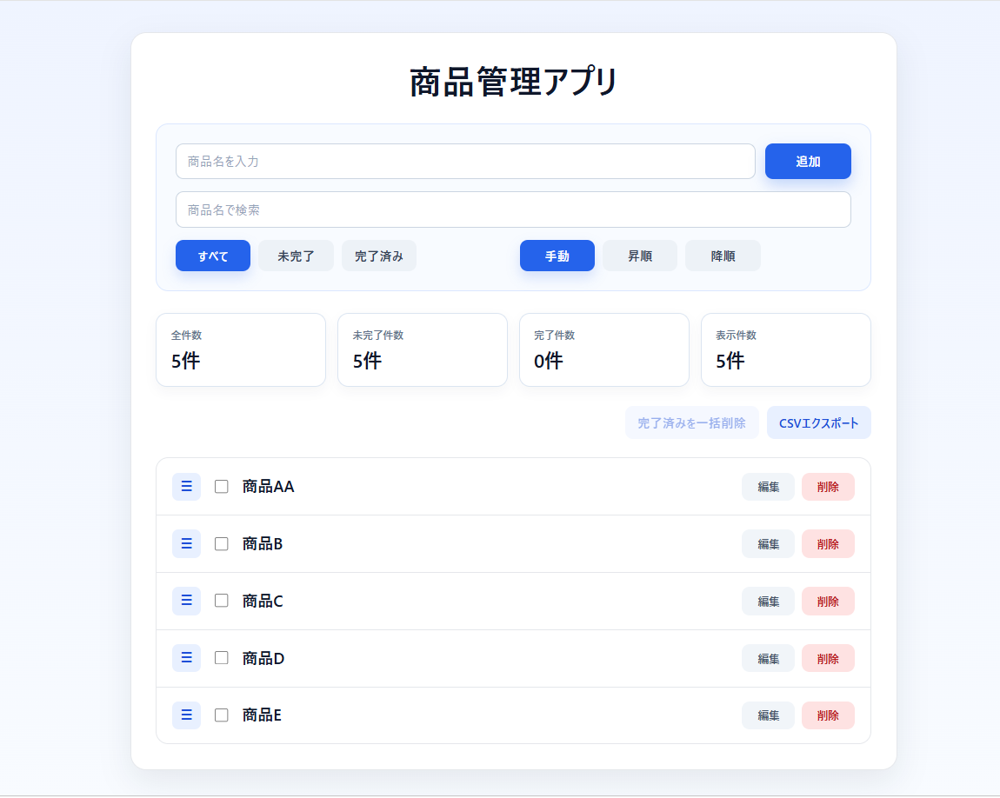
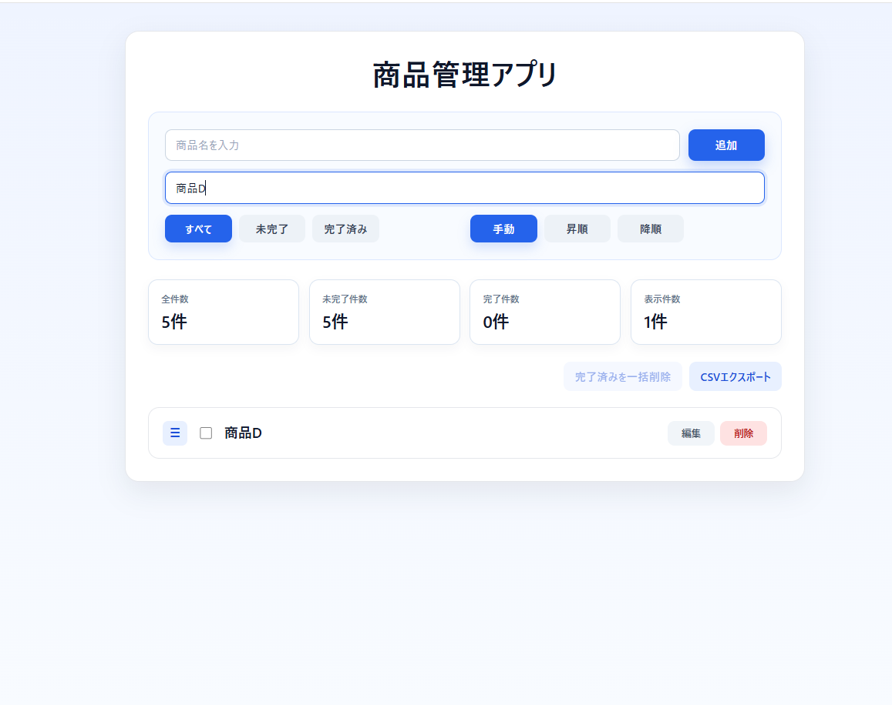
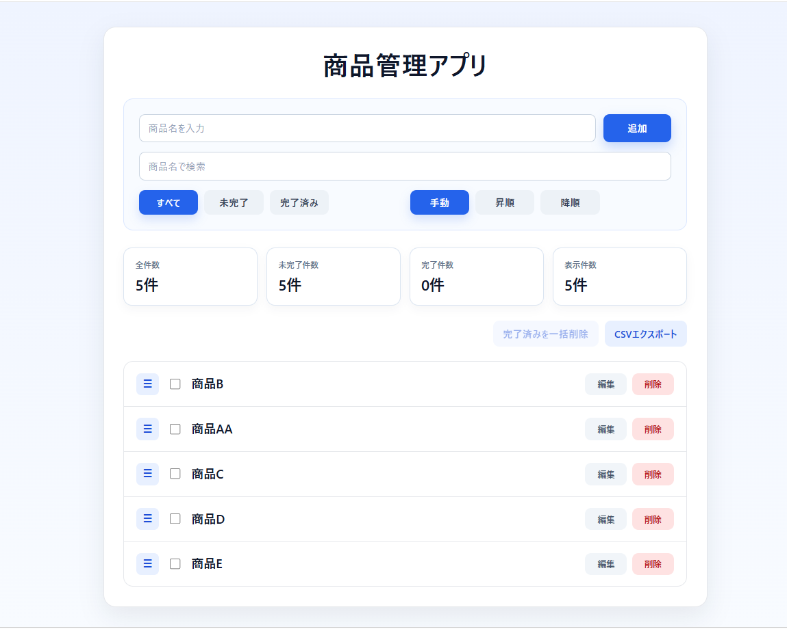
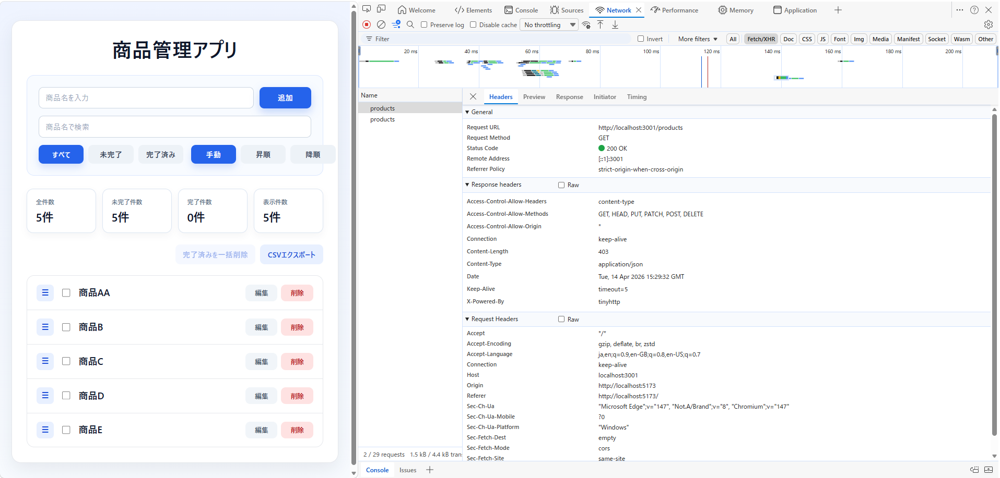
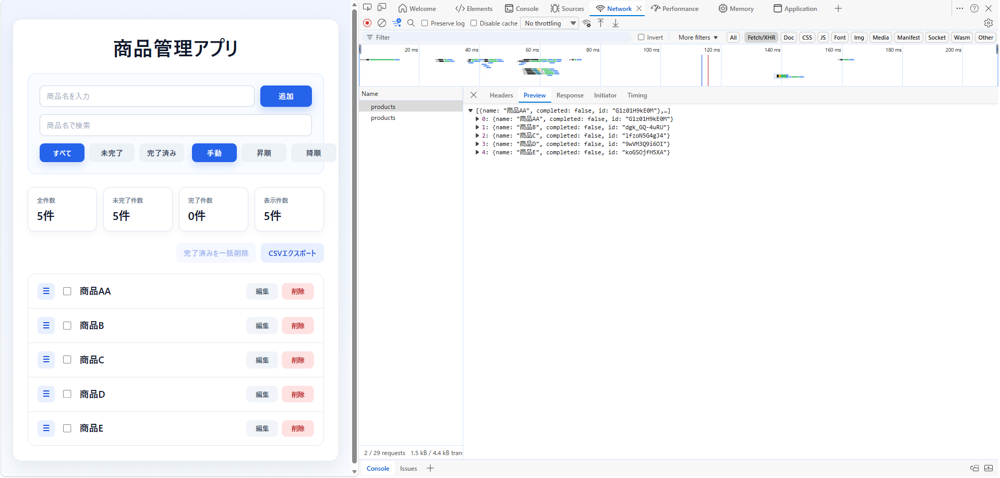

# Product Management App (React)

React + Vite で作成した商品管理アプリです。

フロントエンド開発の学習として、  
単純な画面ではなく **実務を想定した CRUD アプリケーション** を作成しました。

主に以下の内容を学習・実装しています。

- React コンポーネント設計
- 状態管理
- 検索 / フィルター
- 並び替え
- Drag & Drop
- REST API連携
- CSVエクスポート

---

# アプリ画面

## 商品一覧

商品を一覧で管理できます。



---

# 機能紹介

## 商品追加

入力フォームから商品を追加できます。



---

## 商品編集

既存の商品を編集できます。



---

## 商品検索

商品名で検索できます。



---

## 並び替え（Drag & Drop）

商品をドラッグして並び替えることができます。



---

# REST API 連携

このアプリでは **json-server を使って REST API を構築**しています。

React アプリは API から商品データを取得しています。

### API通信（Networkタブ）

GET `/products`



---

### APIレスポンス

APIから取得した商品データ。



---

# 主な機能

## 商品管理

- 商品追加
- 商品編集
- 商品削除
- 完了状態管理
- 完了済み一括削除

## 一覧操作

- 商品検索
- 状態フィルター
- 並び替え（昇順 / 降順）
- Drag & Drop 並び替え

## データ管理

- REST API連携
- CSVエクスポート

---

# 技術スタック

## Frontend

- React
- Vite
- JavaScript
- CSS

## Library

- dnd-kit (Drag & Drop)

## Backend (Mock API)

- json-server

## Tool

- Git
- GitHub

---

# ディレクトリ構成

```
product-app-react
│
├ images
│   ├ home.png
│   ├ add.png
│   ├ edit.png
│   ├ search.png
│   ├ dnd.png
│   ├ api-network.png
│   └ api-response.png
│
├ src
│   ├ components
│   │   ├ ProductForm.jsx
│   │   ├ ProductList.jsx
│   │   ├ ProductItem.jsx
│   │   ├ SearchBar.jsx
│   │   ├ FilterBar.jsx
│   │   └ SortBar.jsx
│   │
│   ├ services
│   │   └ productApi.js
│   │
│   ├ utils
│   │   └ csv.js
│   │
│   ├ App.jsx
│   ├ App.css
│   └ main.jsx
```

# API エンドポイント

json-server を使用しています。

GET /products
POST /products
PATCH /products/:id
DELETE /products/:id

---

# 起動方法

## 1. 依存関係インストール

```
npm install
```

## 2. APIサーバー起動

```
npx json-server db.json --port 3001
```

## 3. フロントエンド起動

```
npm run dev
```

## 4. アクセス

```
http://localhost:5173
```

# 学習目的

このアプリは以下を学ぶ目的で作成しました。

- Reactによるフロントエンド開発
- 状態管理
- API連携
- UI設計
- コンポーネント分割

単なる画面作成ではなく  
**実務を想定したCRUDアプリの実装**を意識しています。